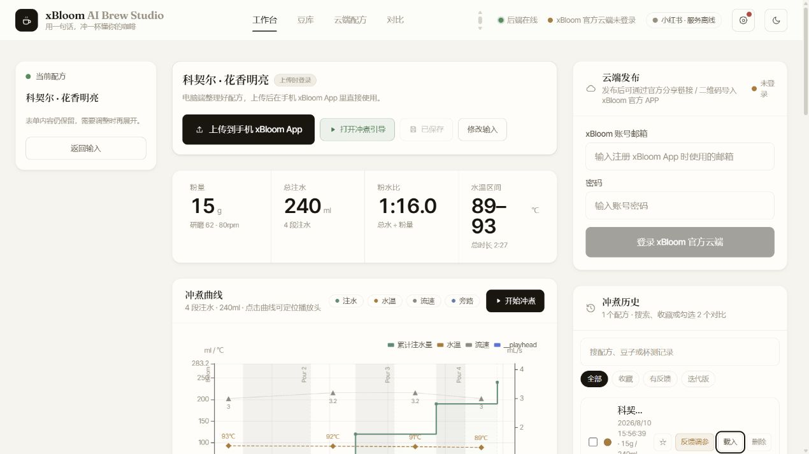
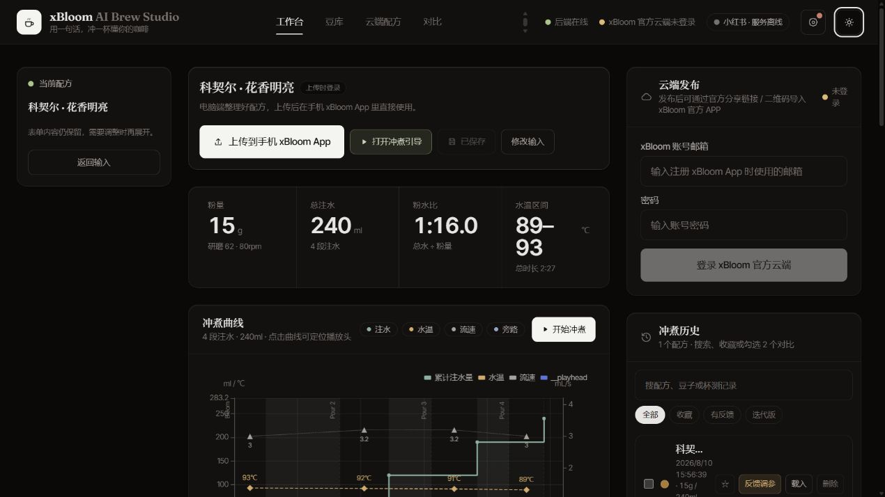
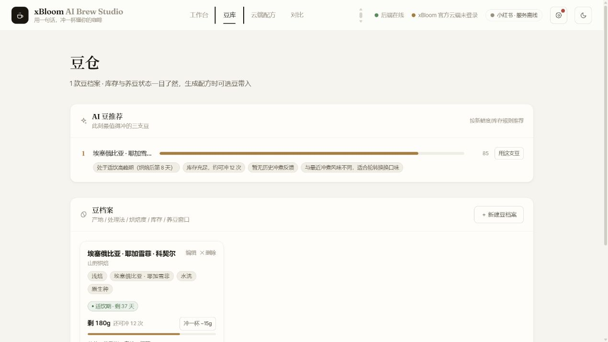

<div align="center">

# xBloom AI Brew Studio

**在电脑上把豆子研究透，再把配方一键上传到手机 xBloom App。**

从豆仓、联网调研、三候选择优，到曲线检查、参数微调、杯测迭代与云端同步，一套完整的桌面冲煮工作流。


</div>



## 为什么做它

xBloom App 很适合执行配方，但在真正上传之前，常常还要查豆商资料、翻社区经验、换算滤杯差异、比较几套参数，再记录每次杯测结果。

这个项目把这些准备工作放到电脑上完成：

1. 选择豆子，写下口味和场景；
2. 从小红书、聚合搜索与网页资料中整理可用信号；
3. 并行生成多套方案，按七个维度评分并自动检查边界；
4. 查看注水曲线、逐段参数和冲煮理由，按需要微调；
5. **上传到 xBloom 云端，随后在手机 xBloom App 中使用。**

它的重点不是让电脑代替手机 App，而是把上传前最费时间的工作做完整。

## 现在已经有什么

| 模块          | 当前能力                                                                                   |
| ------------- | ------------------------------------------------------------------------------------------ |
| AI 配方工作台 | 自然语言输入、结构化豆档案、OpenAI 兼容模型、SSE 流式过程、参考链接、烘焙商方案输入        |
| 联网调研      | 小红书优先、SearXNG、Firecrawl、网页搜索兜底；来源去重、他豆拦截、他滤杯识别、状态如实披露 |
| 多候选择优    | 默认并行生成 3 份方案；七维评分、一票否决、平局裁决、低分换源重调研、参数一致性检查        |
| 自动审查      | 配方 Schema、粉水比可达性、分段总水、温度/流速/研磨/停顿边界、旁路水规则、最多一轮自动修正 |
| 曲线与步骤    | 注水量、水温、流速、旁路曲线；参数统计、逐段步骤、方案解读、桌面冲煮引导与计时             |
| 上传手机 App  | xBloom 登录、发布前字段预览与自动对齐、新建/更新/删除云端配方、云端列表与分享链接          |
| 豆仓          | 豆档案、AI 文本归档、库存、烘焙日与适饮窗口、可冲次数、Top 3 推荐、冲煮后扣减              |
| 杯测迭代      | 星级与味型反馈、基于旧配方再调参、版本链、差异卡、烘焙商原版与 AI 改进版对照               |
| 冲煮历史      | 搜索、收藏、有反馈/迭代版筛选、载入继续编辑、豆档案手动关联                                |
| 小红书        | 页面内扫码登录、状态轮询、退出、Cookie 导入兜底；登录后参与本豆调研                        |
| 桌面体验      | Warm Paper / Espresso 双主题、PWA 缓存壳、守护进程、自恢复、本地日志                       |
| BLE 实验      | 设备扫描、配方编码、下发、停止与边界校验；默认折叠，日常主流程仍是上传手机 App             |

完整细节见 [当前功能全景](docs/FEATURES.md)。

## 界面实拍

<table>
  <tr>
    <td width="50%"></td>
    <td width="50%"></td>
  </tr>
  <tr>
    <td align="center">Espresso 深色工作台</td>
    <td align="center">豆仓、适饮窗口与 AI 推荐</td>
  </tr>
</table>

## Windows 一键安装

### 普通使用者

1. 从 GitHub Releases 下载 `xbloom-ai-brew-studio-vX.Y.Z-windows.zip`；
2. 解压到一个固定目录；
3. 双击 **`install-windows.bat`**；
4. 安装完成后，从桌面的 **xBloom AI Brew Studio** 快捷方式启动。

安装脚本会在项目目录内准备便携版 Node.js、安装依赖、完成构建，并安装经 SHA-256 校验的 Windows 修订版小红书 MCP。修订版可由仓库内脚本从上游 `v2.4.3` 源码复现构建；整个运行环境位于项目自己的 `.runtime` 目录。

> 首次启动小红书服务时会下载浏览器运行组件，通常需要几分钟。

### 已有 Node.js 的开发者

```powershell
npm ci
npm run build
.\start-xbloom.bat
```

要求 Node.js `22.12.0+`；一键安装脚本当前使用 Node.js `24.18.0 LTS`。

实验性 Windows BLE 设备实验室需要 Python 3.10+。安装脚本检测到 Python 时会自动准备；之后也可单独运行 `./install-ble.ps1`。日常路径仍是上传到手机 xBloom App。

## Cloudflare 常在线版

仓库同时提供 [Cloudflare 部署目录](cloudflare/README.md)：同一套 React 界面由 Worker Static Assets 托管，核心配方生成、豆仓和历史使用 Worker + D1；电脑关机后网页继续在线。手机 xBloom App 上传、小红书扫码调研和 BLE 设备实验继续使用每位用户自己的 Windows 本地完整版，不共享作者或部署者的第三方登录态。

## 第一次打开：只填你自己的账号与接口

仓库与发布包均为空配置，不含作者的 URL、API Key、xBloom 账号或小红书会话。

### 1. 配置模型接口

打开右上角 **设置**，填写：

- OpenAI 兼容 API 地址，例如 `https://your-gateway.example/v1`
- 主模型 ID
- API Key
- 可选的备用模型与备用 Key

点击 **保存并测试**。程序会通过同一条 `/chat/completions` 链路发起一个很小的请求，并显示实际使用的模型与耗时。Windows 下保存的 Key 使用当前用户的 DPAPI 加密，读取接口只返回“已配置”状态。

### 2. 登录小红书

打开页面中的小红书账号入口，点击扫码登录，再用你自己的小红书 App 扫码。会话保存在本机 `tools/xhs-mcp/runtime/cookies.json`；整个运行目录均被 Git 忽略，并限制为当前 Windows 用户、SYSTEM 与管理员访问。

### 3. 登录 xBloom 并上传

生成或载入配方后点击 **上传到手机 xBloom App**，在发布面板中输入自己的 xBloom 邮箱与密码。登录成功后，邮箱与密码输入框会立即清空；磁盘只缓存当前 Windows 用户可解开的云端会话 Token。随后先看发布预览，再确认上传，最后回到同一账号的手机 xBloom App 使用该配方。

更细的接口格式、区域与可选服务配置见 [配置说明](docs/CONFIGURATION.md)。

## 数据与隐私

| 内容                                   | 保存位置                               | Git 状态 |
| -------------------------------------- | -------------------------------------- | -------- |
| 模型 URL、模型名、加密后的 Key         | `data/llm-settings.json`               | 已忽略   |
| 豆仓与本地配方                         | `data/beans.json`、`data/recipes.json` | 已忽略   |
| xBloom 会话（Token 使用 DPAPI 保护）   | `data/session.json`                    | 已忽略   |
| 小红书会话                             | `tools/xhs-mcp/runtime/cookies.json`   | 已忽略   |
| 日志、浏览器运行目录、下载的可执行文件 | `data/`、`.runtime/`、`tools/xhs-mcp/` | 已忽略   |

后端固定监听 `127.0.0.1`。提交前可运行：

```powershell
npm run check:release
```

它会检查 Git 跟踪文件中是否混入本地配置、会话、压缩包、日志、绝对用户路径或常见密钥格式。

## 技术结构

```text
React 19 + Vite 7 + Tailwind 4
                 │ /api + SSE
                 ▼
Express 5 + Zod + JSON 原子存储
       ├── OpenAI-compatible LLM
       ├── Xiaohongshu MCP
       ├── SearXNG / Firecrawl / Web research
       ├── xBloom cloud API → 手机 xBloom App
       └── BLE bridge（实验）
```

配方 Schema 与共用安全规则由 `shared/` 工作区统一提供给前后端，避免两份边界规则逐渐分叉。更多内容见 [架构说明](docs/ARCHITECTURE.md)。

## 开发与验证

```powershell
npm ci
npm run test:all
npm run build
npm run format:check
npm run check:release
```

当前基线：后端 543 项、前端 142 项、Cloudflare 2 项，共 687 项测试。GitHub Actions 在 Windows 上执行格式、发布安全检查、全量测试、构建与 Worker dry-run；推送 `v*` 标签时会生成可下载的 Release ZIP。

仓库维护者首次公开与打标签的完整步骤见 [发布到 GitHub](docs/PUBLISHING.md)。

## 常见问题

- 小红书二维码一直加载：看 [小红书服务与首次浏览器下载](docs/TROUBLESHOOTING.md#小红书二维码一直加载)
- 模型测试返回 HTTP 401/404：看 [API 地址与模型名](docs/TROUBLESHOOTING.md#模型连接测试失败)
- 上传后手机 App 里没看到：看 [xBloom 区域与刷新](docs/TROUBLESHOOTING.md#上传后手机-app-里没看到配方)
- 端口被占用或页面没打开：看 [启动与端口](docs/TROUBLESHOOTING.md#页面没有自动打开)

## 贡献与许可证

欢迎提交 Issue 和 Pull Request。改动前请先阅读 [贡献指南](CONTRIBUTING.md)，其中把“保留现有功能与接口契约”列为合并门槛。

项目采用 [MIT License](LICENSE)。第三方组件与协议参考见 [THIRD_PARTY_NOTICES.md](THIRD_PARTY_NOTICES.md)。

> 本项目是独立的社区工具，与 xBloom、小红书不存在官方隶属或背书关系。相关名称与商标归各自权利人所有。
