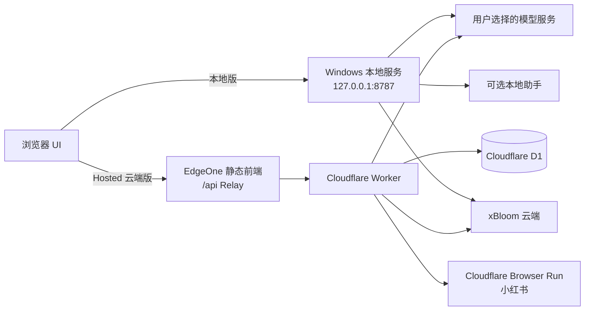
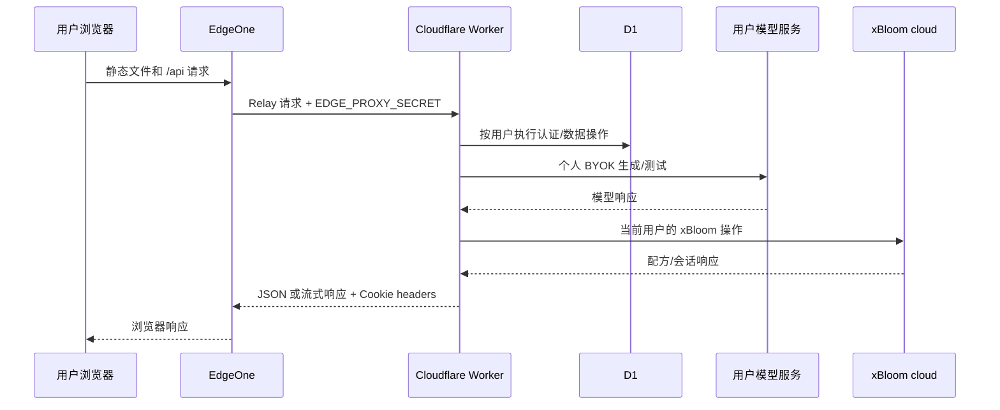
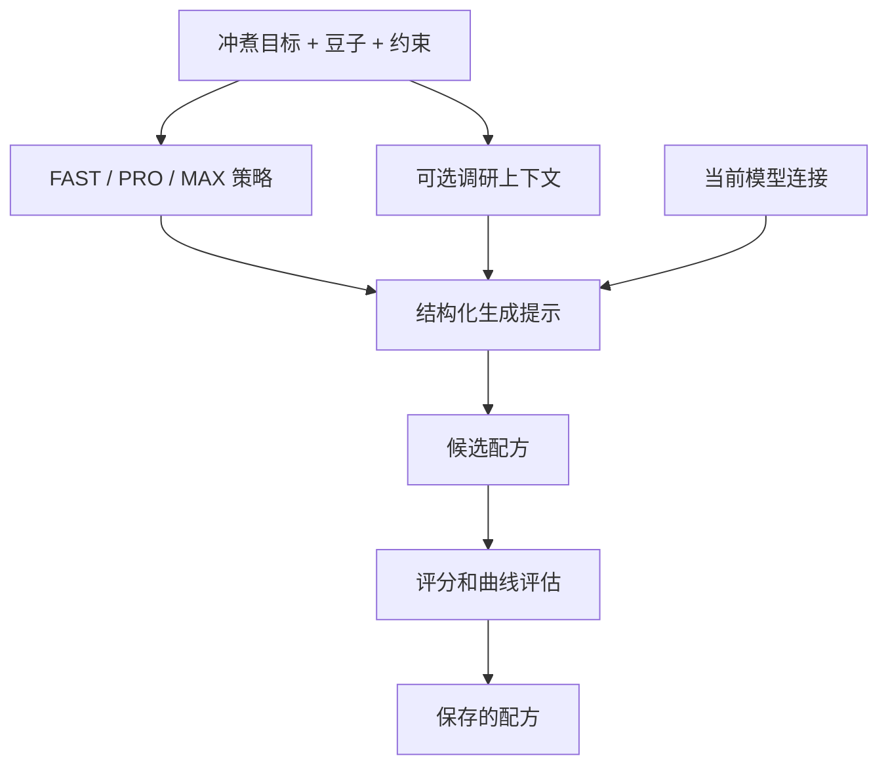
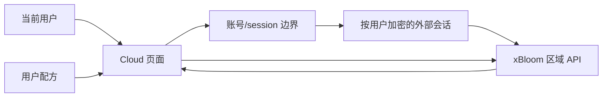

# 架构说明

0.2 同时支持 Windows 本地工作台和 Hosted 云端版。两种部署共用产品流程，但各自使用独立的数据和凭证边界。

## 两种部署形态

| 层          | Windows 本地版                               | Hosted 云端版                                          |
| ----------- | -------------------------------------------- | ------------------------------------------------------ |
| 前端        | Vite 构建的 web UI，由本地服务/watchdog 提供 | 服务入口上的静态 web UI；中国入口使用 EdgeOne          |
| API         | 绑定回环地址的 Express 服务                  | Cloudflare Worker 的 `/api/*` 路由                     |
| 持久化数据  | 本地项目 data 目录和本地设置                 | 以认证用户为 key 的 D1 数据表                          |
| 模型连接    | 用户本地 `.env` 或本地设置存储               | 账号自己的模型元数据与加密 API Key，可选部署级备用连接 |
| xBloom 连接 | 本地账号流程和云端 API，可选 BLE             | 每个用户自己的 xBloom 云端会话和云端 API               |
| 小红书      | 可选本地助手/MCP                             | Browser Run 取码与检索；Cookie 按 owner 加密保存       |

## Hosted 请求链路

1. 浏览器向 Hosted 入口发送账号请求。
2. 中国入口由 EdgeOne 提供静态文件，并把 `/api/*` Relay 到 Cloudflare Worker。Relay 会加入共享代理密钥，并保留会话 Cookie 和流式响应。
3. Worker 校验会话 Cookie，解析当前用户。
4. 配方、豆子、历史记录和模型设置都使用当前用户的 D1 数据。
5. 生成请求会在内存中解密当前用户的模型设置，调用所选服务商，再返回结构化结果。
6. xBloom 请求会在内存中解密当前用户的外部会话，调用配置的 xBloom 区域 API，再把更新后的会话按该用户保存。

账号路由也支持注册前的匿名浏览器所有者。注册或登录后，服务会按照迁移逻辑把该浏览器的可迁移数据关联到认证账号；认证后的读取仍按当前用户限制。

## 中国入口链路

中国部署步骤见[中国部署说明](DEPLOY_CHINA.md)。稳定的中国大陆域名需要已备案的自定义域名，这是运营域名要求，不是模型或账号设置。

## Windows 本地链路

Windows 入口是 `install-windows.bat`，它会调用 PowerShell 安装器。安装器从自身位置计算项目根目录，准备项目内 Node.js 运行时，安装依赖，构建工作区并启动 watchdog。默认 UI/API 地址是 `localhost:5180` 和 `127.0.0.1:8787`。

本地服务加载 `.env`，初始化本地模型设置，挂载配方、豆子和调研路由；存在构建产物时也会提供 web UI。watchdog 负责保持 API 和 UI 进程运行，`stop-xbloom.bat` 用于停止它们。安装器针对 exFAT/FAT 提供物理工作区依赖布局；升级时优先使用本机可写的 NTFS 目录。

## 生成数据流

本地版和 Hosted 云端版使用相同的产品概念，但由不同的存储和凭证适配器提供实现。服务商协议由模型设置决定，web 工作流消费统一的结构化配方结果。

## xBloom 数据流

Windows 本地版可以从本地 Cloud 页面或可选的本地环境配置填写 xBloom 凭证。Hosted 云端版由 Worker 把 xBloom 外部会话关联到认证用户。BLE 是独立的本地能力，不经过 Hosted Worker 数据链路。

## 凭证和信任边界

| 凭证/数据                 | 边界                                 | 需要向用户说明的主要风险                              |
| ------------------------- | ------------------------------------ | ----------------------------------------------------- |
| 个人模型密钥              | 账号记录或本地 `.env`                | 所选模型服务会收到请求内容                            |
| xBloom 会话               | Hosted 按用户加密记录或本地用户状态  | 部署运营者掌握 Worker/D1/密钥环境                     |
| 小红书 Cookie             | Hosted 按 owner 加密或本地助手运行时 | 部署运营者掌握 Worker/D1/密钥；不同 owner 独立        |
| `APP_SESSION_SECRET`      | Cloudflare Worker 密钥               | 轮换会影响已有会话的签名上下文                        |
| `APP_PASSWORD_PEPPER`     | Cloudflare Worker 密钥               | 账号校验值的独立 pepper；常规升级需要保持稳定         |
| `APP_DATA_ENCRYPTION_KEY` | Cloudflare Worker 密钥               | 常规升级需要保持稳定，保证加密 API Key 与外部会话可读 |
| `EDGE_PROXY_SECRET`       | EdgeOne 环境 + Worker 密钥           | Relay 请求需要两边的共享值一致                        |

浏览器 Cookie 使用 `HttpOnly`，并受 Hosted 会话路径限制。模型 API key 保存后不会由设置 API 返回。Hosted 小红书只在取码、确认和检索时启动 Browser Run；状态查询读取 D1 密文状态。Windows 本地助手继续使用回环源站和本地运行时。

## 降级行为

- Hosted 账号没有个人模型连接时，账号设置页面会提示配置并测试模型后再生成。
- 小红书未登录或 Browser Run 额度暂不可用时，直接生成仍会继续；PRO/MAX 会如实显示本次调研状态。
- 没有 xBloom 会话时，配方创建和本地保存仍可独立进行，稍后再连接 xBloom 云端。
- 模型服务报错或超时时，接口返回错误路径，不会静默使用另一个用户的凭证。
- 本地端口冲突时，服务会报告被占用的端口；修改本地配置中的 `PORT`/`WEB_PORT` 后重新启动。

该架构把账号自己的 BYOK 与部署者自己的 guest 设置分开。Hosted 部署不需要为所有账号准备一把共享用户模型密钥。
