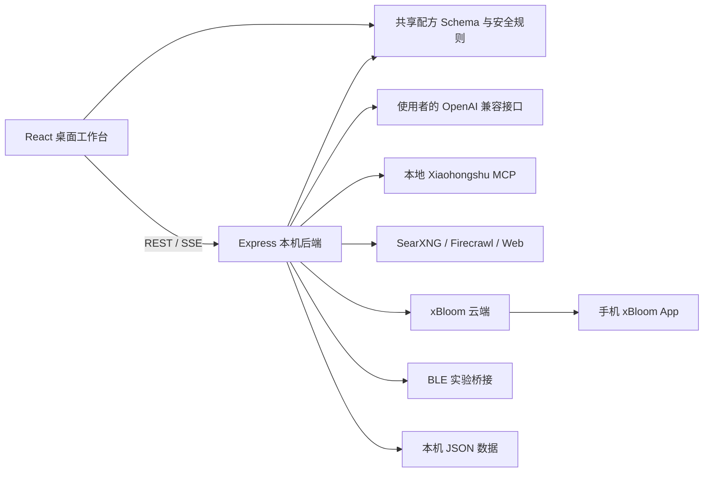
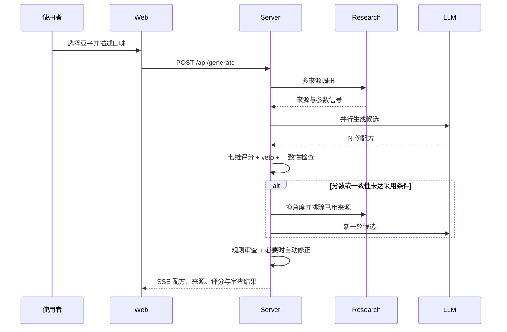

# 架构说明

## 总览

## npm workspaces

| 工作区    | 职责                                                            |
| --------- | --------------------------------------------------------------- |
| `shared/` | 前后端共用的 Recipe Schema、枚举、边界、映射与配方安全规则      |
| `server/` | 生成编排、调研、评分、审查、本地数据、xBloom、小红书与 BLE 接口 |
| `web/`    | React 桌面界面、SSE 状态归约、曲线、编辑、豆仓、历史与发布流程  |

## 核心生成链路

## 上传手机 App 链路

桌面端并不直接操作手机。发布面板将内部配方转换并预览为 xBloom 云端字段，确认后写入使用者自己的 xBloom 云端账号；手机 App 再读取该账号下的配方。

`server/src/lib/xbloom-cloud.ts` 集中处理：

- 全球区/中国区地址；
- 登录与本机会话；
- 内部总水量和云端粉水比语义转换；
- 整数注水与 0.1 粉水比步进对齐；
- 新建、更新、删除、列表与分享详情。

## 小红书链路

`xiaohongshu-mcp` 在本机独立进程中运行。后端通过 JSON-RPC 完成登录状态、二维码、搜索和详情读取；前端只接收状态、二维码 Data URL 与脱敏后的结果。Cookies 由每位使用者自行扫码产生，固定留在 Git 忽略目录。

## 本地数据

所有运行数据写入项目目录，不依赖数据库：

- 原子写文件，降低中途退出造成的损坏风险；
- 豆仓和配方写操作使用文件级互斥；
- 本地模型设置通过串行队列更新；
- Key 使用 Windows DPAPI 加密；
- `data/` 整体不进入版本控制。

## 可选能力的加载方式

xBloom 云端与 BLE 路由采用动态加载。BLE 原生依赖出现环境问题时，不影响日常的生成、豆仓、历史、调研和云端上传工作流。
